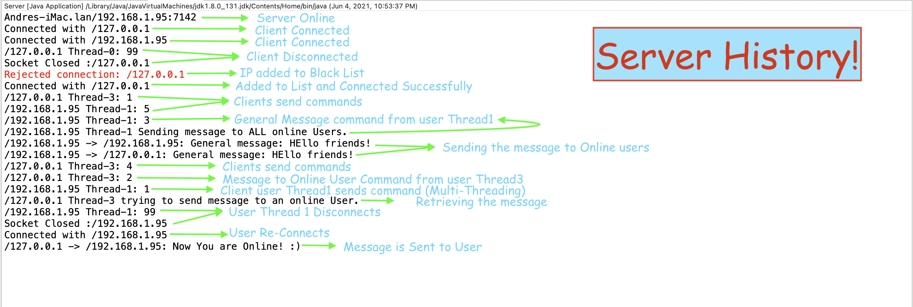

# RC final project

---

## About

	Authors: Andre Hernandez - Duarte Parreira

In this project we programmed a server which takes clients and the clients can make requests. The clients can send messages through the server.


## Development Main Topics

- Java
- Java Threads
- Packets/Sockets
- Transmission Control Protocol (TCP)
- User Datagram Protocol (UDP)


# Getting started

> If you decide to use the command line, you should create two files in the root of the project were you compile the Classes.
> + white-list.txt 
> + black-list.txt

**Usage**

```bash
	# Go to the directory or use an IDE for Java (Eclipse or InteliJ are recommended)
	$ cd <src/project>

	# If you are using the terminal, compile the java files
	$ javac Server.java
	$ javac Client.java
	$ javac ClientUDP.java

	# You must have an IP from your network
	
	# Start the server
	$ java Server.java
	# Start the client
	$ java Client.java <IP>
	# Start the client messages
	$ java ClientUDP.java <IP>

```

## UML
<h1 style="text-align: center">
	
</h1>


## Examples

<h1>
	
</h1>


For any further questions contact me at: **pulgamecanica11@gmail.com**